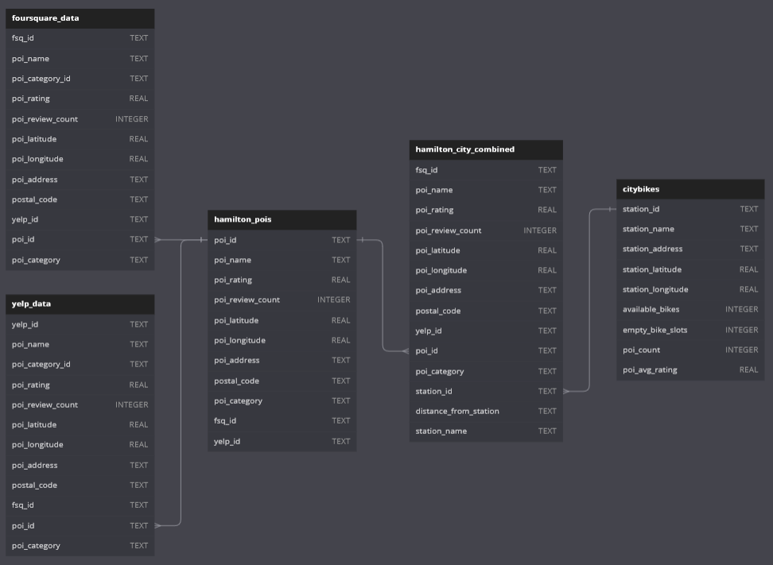

# Final-Project-Statistical-Modelling-with-Python

# Project/Goals
The goal of this project is to analyze bike-sharing data in **Hamilton, ON, CA** by integrating data from the CityBikes API with Points of Interest (POIs) data from Yelp and Foursquare APIs.

This project combines and applies skills learned so far, including working with Python for API calls, data cleaning, transformation, and storage, and performing exploratory data analysis with statistics, visualizations, and predictive models.

POIs of Choice:
- Restaurants
- Amusement Parks
- Museums

Specifically, the project aims to:

- **Retrieve and Process Bike-Sharing Data:** Extract information about bike stations, including their locations and bike availability.

- **Gather POI Data:** Collect information on nearby restaurants, amusement parks, and museums using Yelp and Foursquare APIs.

- **Compare API Coverage and Quality:** Assess and compare the richness and comprehensiveness of data provided by Yelp and Foursquare for the selected city.

- **Data Integration and Visualization:** Combine bike-sharing data with POIs data to explore spatial relationships and patterns.

- **Build Predictive Models:** Develop regression models to understand how the characteristics of nearby POIs influence the number of available bikes at each station.

In this particular project, the objective was to demonstrate a relationship between the number of bikes in a particular location and the characteristics of the points of interest in that location. The structured data enabled exploratory data analysis, allowing for the identification of trends and patterns within the data. These insights were further used to predict future outcomes through estimates or conclusions.

Ultimately, the project seeks to provide insights into how urban amenities impact bike-sharing usage, which can inform urban planning and bike-sharing service optimizations.

 

# Process
### Tools Used
A quick run down of tools we used:
| Tools      | Usecase                               |
|:-----------|:--------------------------------------|
| [Github](https://github.com)     | You're here!                          |
| [VS Code](https://code.visualstudio.com)   | IDE                                   |
| [DB Diagram ](https://dbdiagram.io)| Quick Interface to create DB Diagrams |

### APIs Used
A list of APIs we interacted with:
| APIs       | Usecase           |
|:-----------|:------------------|
| [Citybikes](https://citybik.es/)  | Bike Sharing Data |
| [Foursquare](https://developer.foursquare.com/places) | POI Data          |
| [Yelp](https://docs.developer.yelp.com/docs/fusion-intro)       | POI Data          |

### Python Libraries used:
| Python Libraries   | Usecase                                    | Install with pip         | Install with conda         |
|:-------------------|:-------------------------------------------|:-------------------------|:---------------------------|
| os                 | OS Operations, Loading system variables    | Built-in                 | Built-in                   |
| json               | JSON Parsing                               | Built-in                 | Built-in                   |
| time               | Time Operations, Time Delays for API Calls | Built-in                 | Built-in                   |
| re                 | Regular Expressions, Used for cleaning     | Built-in                 | Built-in                   |
| requests           | HTTP Requests, API calls                   | pip install requests     | conda install requests     |
| pandas             | Data Manipulation                          | pip install pandas       | conda install pandas       |
| matplotlib         | Data Visualization                         | pip install matplotlib   | conda install matplotlib   |
| seaborn            | Data Visualization                         | pip install seaborn      | conda install seaborn      |
| scikit-learn       | Machine Learning                           | pip install scikit-learn | conda install scikit-learn |
| numpy              | Mathematical Operations                    | pip install numpy        | conda install numpy        |
| statsmodels        | Statistical Operations                     | pip install statsmodels  | conda install statsmodels  |

**Tips:**

Updating/Installing modules...

**Pip: `pip install --U --all`** 

--  Update pip: `python -m pip install -U pip`
  - `pip` sometimes have issues installing new modules... use this syntax instead:
  
    `pip install -user <module>`

**Conda: `conda update --all`**
  - `conda` can also be picky with some modules... use this syntax instead:
  
    `conda install -c conda-forge <module>`

 

### Part 1: Connecting to CityBikes API
> See more about the process [here](./notebooks/city_bikes.ipynb).

Using the CityBikes API, I performed the following steps:

- **Explored the API Structure:** Investigated available endpoints and the structure of the returned JSON data.
- **Selected City:** Hamilton, ON, CA for its manageable number of bike stations in relation to API Calls limitations.
- **Retrieved Bike Stations:** Fetched all available bike stations in Hamilton, extracting relevant details.
- **Data Extracted Included:**
  - station_id
  - name
  - address
  - postal_code
  - latitude
  - longitude
  - num_bikes_available : 'free bikes' at the time of retrieval
  - num_docks_available : 'empty slots' at the time of retrieval
- **Parsed Data into Pandas DataFrame:** Converted the JSON response into a structured Pandas DataFrame for easier manipulation and analysis.

 

### Part 2: Connecting to Foursquare and Yelp APIs
- **Connected to Foursquare API:** Utilized the Foursquare Places API to gather POI data.Connected to Yelp API: Leveraged the Yelp Fusion API for similar POI information.
- **Queried POIs Near Bike Stations:** For each bike station in Hamilton, retrieved nearby restaurants,  amusement parks, and museums.
- **Created DataFrames:** Organized the retrieved data into separate Pandas DataFrames for Yelp and Foursquare results.
- **Compared API Quality:** Evaluated the completeness and coverage of each API based on criteria such as the number of POIs, availability of ratings, and geographical diversity.

 

### Part 2.1: Cleaning and Exploration
> See more about the process [here](./data/cleaning.ipynb)
- **Data Cleaning:** Standardized addresses, filled in missing postal codes, and unified POI categories across datasets.
- **Data Preparation:** Created a streamlined version of the dataset containing only relevant info of POIs for SQL integration.

 

### Part 3: Joining Data
> See more about the process [here](./notebooks/joining_data.ipynb)
- **Merged Datasets:** Combined the bike-sharing data with Yelp and Foursquare POIs data based on geographical proximity.
- **Data Visualization:** Utilized visualization tools to explore spatial distributions and relationships between bike availability and nearby POIs.
- **SQLite Database Creation:** Designed and implemented a SQLite database to store the integrated data, ensuring efficient querying and data management.
- **Data Validation:** Verified the integrity and consistency of the joined data to ensure accurate analyses.

- **Schema**: The DB looks like this:
  
- **Tables:**
    - `citybikes` -- Contains the station details. (Shape: 190, 9)
      - **Primary Key:** 'station_id'
      - Foreign Key(s): None.
    - `hamilton_pois` -- POIs in Hamilton without station data. (Shape: 1194, 11)
      - **Primary Key:** 'poi_id'
      - Foreign key(s): 'fsq_id' (foursquare_data), 'yelp_id' (yelp_data)
    - `foursquare_data` -- Contains POIs from Foursquare only. (Shape: 666, 12)
      - **Primary Key:** 'fsq_id'
      - Foreign key(s): 'poi_id' (hamilton_pois)
    - `yelp_data` -- Contains POIs from Yelp only. (Shape: 528, 12)
      - **Primary Key:** 'yelp_id'
      - Foreign key(s): 'poi_id' (hamilton_pois)
    - `hamilton_city_combined` -- Contains all the data. (Shape: 18675, 19)
      - **Primary Key:** None.
      - Foreign key(s): 'poi_id' (hamilton_pois), 'yelp_id' (yelp_data), 'fsq_id' (foursquare_data), 'station_id' (citybikes)

 

### Part 4: Building Models
> See more about the process [here](./notebooks/model_building.ipynb)

- **Regression Model Development:** To identify relationships between bike station activity and nearby POIs, I developed a regression model using Python’s `statsmodels` module. The target variable was poi_count, representing the number of POIs near each bike station.

- **Classification Problem Exploration (Stretch Goal):** The regression problem was transformed into a classification problem by creating three classes for poi_count.

## Results
### Comparative Quality of Yelp and Foursquare APIs

**Yelp:**
- **Detailed Metadata:** Provides comprehensive information including poi_rating and poi_review_count, which are useful for assessing the quality and popularity of POIs.
- **Higher Precision in Distances:** Offers more precise calculations for distance_from_station (9,523 entries vs. 986 for Foursquare).

**Foursquare:**
- **Broader POI Coverage:** Captures a larger number of unique POIs with greater geographical diversity, including precise poi_latitude, poi_longitude, and poi_address.
- **Unique POIs:** Foursquare has a higher number of unique POIs, making it valuable for location-specific analyses.

**In Conclusion:**

Yelp excels in providing rich metadata and precise distance measurements, making it ideal for quality assessments of POIs. In contrast, Foursquare offers broader coverage and more unique POIs, which is beneficial for comprehensive spatial analyses. Depending on the project's focus—whether on POI quality or coverage—each API has its strengths.

### Regression Model Results
To identify the relationship between POI characteristics and POI density (`poi_count`), a regression model was developed using the following predictors:

- available_bikes
- empty_bike_slots
- poi_avg_rating
- poi_avg_distance_from_station

**Key Findings:**
- poi_avg_rating was the most significant predictor of poi_count (p < 0.001), with a coefficient of 17.73.
  - A 1-unit increase in the average POI rating is associated with ~18 more POIs.
- Bike Availability Metrics (available_bikes and empty_bike_slots) showed weak and insignificant relationships.
- The model achieved an R-squared value of 0.175, indicating that the predictors explain 17.5% of the variance in poi_count.

 

### Classification Model Results

- The High POI Count class was best predicted, with a precision of 75%.
- Low and Mid classes showed significant overlap, leading to poorer performance in those categories.

**Key Insights:**

- **POI Ratings Influence Density:** Stations located near higher-rated POIs tend to have more POIs overall.
- **Bike Station Metrics:** Features like available_bikes and empty_bike_slots are not strong predictors of POI density.
- **Classification Challenges:** Mid-range POI counts overlap significantly with Low and High classes, leading to misclassifications.

> [Report things](./data/report_things.ipynb)

 

# Challenges 
Throughout the project, several challenges were encountered:

### API Limitations:
**Initial Choice of City:**
- Selecting Toronto initially resulted in managing 861 bike stations, which, combined with Yelp’s API call limitations, would have required extensive time (5-7 days) to gather all necessary data. Switching to Hamilton reduced the number of stations and API calls, facilitating quicker data collection.
### Data Complexity and Iterations:
**Evolving Data Requirements:**
- Subsequent iterations revealed the need for additional data attributes from the APIs that were not initially planned. This necessitated multiple runs and adjustments to data collection scripts.

**File Management:**
- Handling varied and large datasets across different runs led to confusion despite organized file naming, complicating data management and integration efforts.
### Data Integration Challenges:
**POI Matching:** 
- Ensuring accurate matches between POIs from Yelp and Foursquare required careful handling of poi_name and poi_address due to variations and inconsistencies between the two sources.
### Time Constraints:
Balancing data retrieval, cleaning, and analysis within project deadlines required prioritizing tasks and sometimes reworking previous steps to accommodate new insights or requirements.

## In summation: I started over twice...

On my first run, my city of choice was Toronto. It had 861 stations and with the API call limitations on Yelp, I would have had to spread out the data gathering over at least 5-7 days. I decided that having the data I need "now" is crucial to being able to proceed further in the project. I cut my losses and started over using a new, smaller city compared to Toronto: Hamilton.

On the second run, I learned so much more about the APIs, the data, and realized, I needed or wanted more information from the API that I did not initially call for on the first run and on the second. It got to a point where I had so much variation in the files I had saved and despite being organized with naming of files, going between them was confusing me.

Third time's the charm. I went with the same city, Hamilton, and I was able to get back to where I was in the second run in ~2hrs.

 

# Future Goals
If given more time, the following enhancements and expansions would be pursued:

### Expand to Multiple Cities:
- **Comparative Analysis:** Collect and analyze data from additional cities to compare POI impacts on bike-sharing across different urban environments.

- **Comprehensive POI Lists:** Develop a nationwide or global list of top POIs based on ratings and review counts accessible by bike, providing broader insights into urban bike-sharing dynamics.
### Temporal Analysis:
- **Bike Availability Patterns:** Investigate how bike availability fluctuates at different times of day and days of the week.

- **POI Activity Correlation:** Examine the relationship between temporal POI activity (e.g., restaurant peak hours) and bike availability, potentially uncovering time-based usage trends.

### Conclusion:

This project successfully integrated bike-sharing data with POIs from Yelp and Foursquare APIs to explore the relationships between bike availability and urban amenities in Hamilton, ON.

Through data collection, cleaning, analysis, and modeling, valuable insights were gained into how the distribution and characteristics of POIs influence bike-sharing usage.

The comparative analysis of Yelp and Foursquare highlighted the strengths of each API, informing future data-driven urban planning and bike-sharing service optimizations.